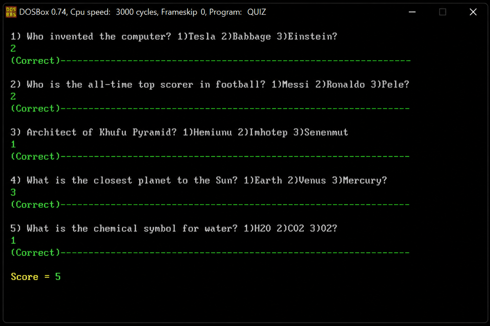

# 🎯 Assembly Quiz Game

A simple **Quiz Game developed using 8086 Assembly Language**.

This project was created as an academic project to practice the fundamentals of **Assembly Language**, including registers, memory, procedures, loops, conditional branching, keyboard input, screen output, and DOS interrupts.

---

## 📸 Project Preview



---

## 📌 About The Project

The **Assembly Quiz Game** is a console-based quiz application developed using **8086 Assembly Language**.

The player is presented with a number of multiple-choice questions. For each question, the player enters the number corresponding to their chosen answer.

The program checks the answer, calculates the player's score, and displays the final result at the end of the quiz.

The project demonstrates how basic programming concepts can be implemented at a low level using Assembly Language.

---

## ✨ Features

* 🎮 Console-based quiz game
* ❓ Multiple-choice questions
* ⌨️ Keyboard input
* ✅ Automatic answer checking
* 🧮 Score calculation
* 📊 Final score display
* 🔄 Uses loops and conditional statements
* 🧩 Uses procedures for organizing the program
* 💻 Developed for the 8086 architecture
* 🖥️ Runs using DOS/TASM environment

---

## 🛠️ Technologies Used

| Technology           | Usage                        |
| -------------------- | ---------------------------- |
| **8086 Assembly**    | Main programming language    |
| **TASM**             | Turbo Assembler              |
| **DOSBox**           | Running the Assembly program |
| **x86 Architecture** | Target architecture          |

---

## 🧠 Assembly Concepts Used

This project applies several fundamental Assembly Language concepts.

### Registers

The program uses 8086 registers such as:

* `AX`
* `BX`
* `CX`
* `DX`
* `DS`

These registers are used for calculations, data manipulation, loops, and communication with DOS services.

---

### Memory and Data Segment

The program uses the `.DATA` segment to store questions, answers, and other required data.

Example:

```asm
.DATA

Q1 DB '1) Who invented the computer? 1)Tesla 2)Babbage 3)Einstein?','$'
Ans1 DB '2'
```

The question is stored as a string, while the correct answer is stored separately.

---

### Procedures

The program can organize repeated operations into procedures.

For example, procedures can be used for:

* Displaying questions
* Reading user input
* Checking answers
* Displaying the score

This makes the program easier to understand and maintain.

---

### Loops

Loops are used to repeat operations such as processing multiple questions.

Instead of writing the same logic for every question, the program can use loop instructions to repeat the required operations.

---

### Conditional Branching

Conditional jumps are used to determine whether the player's answer is correct.

For example:

```asm
CMP AL, Ans1
JE CORRECT
```

The program compares the user's answer with the correct answer and jumps to the appropriate section.

---

### DOS Interrupts

The program uses DOS interrupt `21h` to communicate with the operating system.

For example, displaying a string can be done using:

```asm
MOV AH, 09H
INT 21H
```

Keyboard input can also be handled using DOS services through `INT 21H`.

---

## 🎮 How The Game Works

The general flow of the program is:

```text
        ┌───────────────┐
        │    Start      │
        └───────┬───────┘
                │
                ▼
        ┌───────────────┐
        │ Display Intro │
        └───────┬───────┘
                │
                ▼
        ┌───────────────┐
        │ Display Q1    │
        └───────┬───────┘
                │
                ▼
        ┌───────────────┐
        │ Read Answer   │
        └───────┬───────┘
                │
                ▼
        ┌───────────────┐
        │ Check Answer  │
        └───────┬───────┘
                │
          ┌─────┴─────┐
          │           │
        Correct     Wrong
          │           │
          ▼           ▼
      Score +1     Continue
          │           │
          └─────┬─────┘
                │
                ▼
        ┌───────────────┐
        │ Next Question │
        └───────┬───────┘
                │
                ▼
        ┌───────────────┐
        │ Final Score   │
        └───────┬───────┘
                │
                ▼
        ┌───────────────┐
        │     Exit      │
        └───────────────┘
```

---

## 📚 Example Questions

The quiz contains multiple-choice questions.

Example:

```text
1) Who invented the computer?

1) Tesla
2) Babbage
3) Einstein
```

The player enters:

```text
2
```

The program compares the entered answer with the stored correct answer.

If the answer is correct, the score is increased.

---

## 📂 Project Structure

```text
Assembly-Quiz/
│
├── AssemblyQuiz.asm
├── assembly.png
└── README.md
```

### Files

#### `AssemblyQuiz.asm`

The main Assembly Language source code containing the complete quiz implementation.

#### `assembly.png`

A screenshot/preview of the running Assembly Quiz application.

#### `README.md`

Project documentation.

---

## ⚙️ Requirements

To run the project, you need:

* Windows
* DOSBox
* TASM / Turbo Assembler
* TLINK / Turbo Linker

---

## 🚀 How To Run

### 1. Install DOSBox

Install DOSBox on your computer.

### 2. Prepare The Project

Place the Assembly source code and TASM tools inside an accessible folder.

Example:

```text
C:\ASM
```

---

### 3. Open DOSBox

Launch DOSBox.

---

### 4. Mount The Project Folder

Inside DOSBox, mount the folder containing the project.

```text
mount c c:\asm
```

Then:

```text
c:
```

---

### 5. Assemble The Program

Use TASM to assemble the source file:

```text
tasm AssemblyQuiz.asm
```

If the assembly process completes successfully, an object file will be generated.

---

### 6. Link The Program

Use TLINK:

```text
tlink AssemblyQuiz.obj
```

This generates the executable file.

---

### 7. Run The Game

Run the generated executable:

```text
AssemblyQuiz.exe
```

The quiz should start in the DOS environment.

---

## 🧪 Example Execution

```text
================================
       ASSEMBLY QUIZ GAME
================================

1) Who invented the computer?
1) Tesla
2) Babbage
3) Einstein

Enter your answer: 2

Correct Answer!

--------------------------------

Next Question...
```

At the end, the player receives the final score.

Example:

```text
================================
          FINAL SCORE
================================

Your Score: 4 / 5

Thank you for playing!
```

---

## 🧩 Program Structure

The program is divided into several logical parts.

### 1. Data Section

Contains:

* Questions
* Correct answers
* Messages
* Score-related data

Example:

```asm
.DATA

Q1 DB '1) Who invented the computer? 1)Tesla 2)Babbage 3)Einstein?','$'
Ans1 DB '2'
```

---

### 2. Code Section

Contains the program's main logic.

The code is responsible for:

1. Initializing the data segment.
2. Displaying the quiz.
3. Reading user input.
4. Comparing the answer.
5. Updating the score.
6. Moving to the next question.
7. Displaying the final score.
8. Exiting the program.

---

## 🔢 Score System

The program maintains a score variable.

When the user selects the correct answer:

```text
Score = Score + 1
```

When the answer is incorrect, the score remains unchanged.

After all questions have been answered, the final score is displayed.

---

## 🎯 Learning Objectives

The main goals of this project are to practice:

* 8086 Assembly Language
* CPU registers
* Memory organization
* Data and code segments
* DOS interrupts
* Keyboard input
* Screen output
* Comparisons
* Conditional jumps
* Loops
* Procedures
* Variables
* Basic program control flow

---

## 🔍 What I Learned

Through this project, I gained practical experience with low-level programming and learned how common programming concepts are implemented directly at the processor level.

The project helped demonstrate the difference between high-level programming languages and Assembly Language, especially in terms of:

* Direct register manipulation
* Memory access
* CPU instructions
* Low-level input/output
* Manual control of program flow

---

## 🚧 Future Improvements

Possible improvements include:

* Adding more questions
* Randomizing questions
* Adding different quiz categories
* Adding difficulty levels
* Adding a timer
* Improving the user interface
* Adding colored text
* Adding a replay option
* Adding a high-score system
* Improving input validation

---

## 👨‍💻 Author

**Mohamed Ali**

Computer Science Student
Faculty of Computers and Information
Mansoura University

---

## ⭐ Project Purpose

This project was developed as an educational project to demonstrate fundamental concepts of **8086 Assembly Language programming** through a simple and interactive quiz application.

If you find the project useful, feel free to ⭐ the repository!
